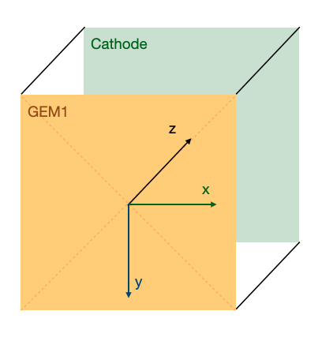

# digitizationpp

** work in progress **

Digitization code in C++

## Usage on cygno-cloud
Since image 2.4, the digitization code dependencies are already installed and just typing cygno_setup, sets all the variables required for digitization to work.

## Dependencies

* ROOT [compiled with the C++17 or C++20 standard]
* ROOTANA [https://bitbucket.org/tmidas/rootana/src/master/]
* OPENCV [https://docs.opencv.org/4.x/d7/d9f/tutorial_linux_install.html]
* oneAPI TBB [https://github.com/oneapi-src/oneTBB] (tested with release 2021.12.0 linux)

Before compiling, set the variables ROOTANASYS and OPENCVSYS in your environment:

`export ROOTANASYS="/path/to/rootana/installation/"`

`export OPENCVSYS="/path/to/opencv/installation/"`

In the file you use to call the source of thisroot.sh (your setup file or .bashrc), add after the source of the thisroot.sh the line:

`export CMAKE_PREFIX_PATH=$CMAKE_PREFIX_PATH:$OPENCVSYS`

### Install TBB
One can install following the procedure explained in [here](https://github.com/oneapi-src/oneTBB/blob/master/INSTALL.md).

Alternatively, one can download the release desired (tested with 2021.12.0, but 2021.13.0 now available):

`wget https://github.com/oneapi-src/oneTBB/releases/download/v2021.12.0/oneapi-tbb-2021.12.0-lin.tgz`
or by directly downloading the precompiled oneapi-tbb version from [Release](https://github.com/oneapi-src/oneTBB/releases).

Then untar:

`tar zxf oneapi-tbb-2021.12.0-lin.tgz`

It is highly recommended to add to the environment the following variable:

`export TBBROOT="<path_to_tbb_folder>"`

In order to enable oneapi TBB the user needs to source it:

`source ${TBBROOT}/env/vars.sh`

Be careful that this last line can mess the path of the C++ compiler and require TBB to be always present even when not required. Thus, it is strongly suggested not to add it to bashrc, but to use it only when tbb will be used.

## Installation

`git clone https://github.com/CYGNUS-RD/digitizationpp.git`

`cd digitizationpp`

`export CXX="/path/to/your/c++17or20/compiler"`

`mkdir build-dir && cd build-dir`

`cmake ..`

`cmake --build .`

Generate documentation inside the `doc/html` folder:

`doxygen doc/doxygen.cfg`

Documentation should be then available at `doc/html/index.html`.

## Suggested usage

Put all the MC `.root` files you want to digitize in an input folder (<input_folder>)
Move to a desired folder where to launch the code

`./<path_to_build-dir>/digitizationpp <path_to_digitizationpp-dir>/config/ConfigFile_new.txt -I <path_to_input_folder> -O <path_to_output_folder>`

If not existing, the Outdir will be created. The -I and -O options can be droppped and the code will search inputfiles in
`<path_to_digitizationpp-dir>/input/`
and the outdir will be created in 
`<path_to_digitizationpp-dir>/OutDir/`

Depending on the system, the outdir folder creation may fail. In that case create the output directory.

## Digitization reference frame

The reference frame (RF) used in digitization is the following:
* the vertical axis (**y**) is pointing towards the bottom (in this RF gravity acceleration is positive)
* horizontal axis (**x**) is pointing to the right if we look at the GEMs from the point of view of camera
* depth axis (**z**) is pointing from GEMs to cathode
* the **origin** is at the center of the detector/image in xy and on the top face of GEM1 in z

Here's an image showing this RF:

This means that **the user must specify the relative orientation of the axes and the relative origin offset between the input MC reference frame and the digitization reference frame**. This is realized by means of the parameters `MC_xaxis`, `MC_yaxis`, `MC_zaxis`, and `x_offset`, `y_offset`, `z_offset`.

# Example
From `<path_to_digitizationpp-dir>`

`cd build-dir`

`./digitizationpp ../config/ConfigFile_new.txt`
